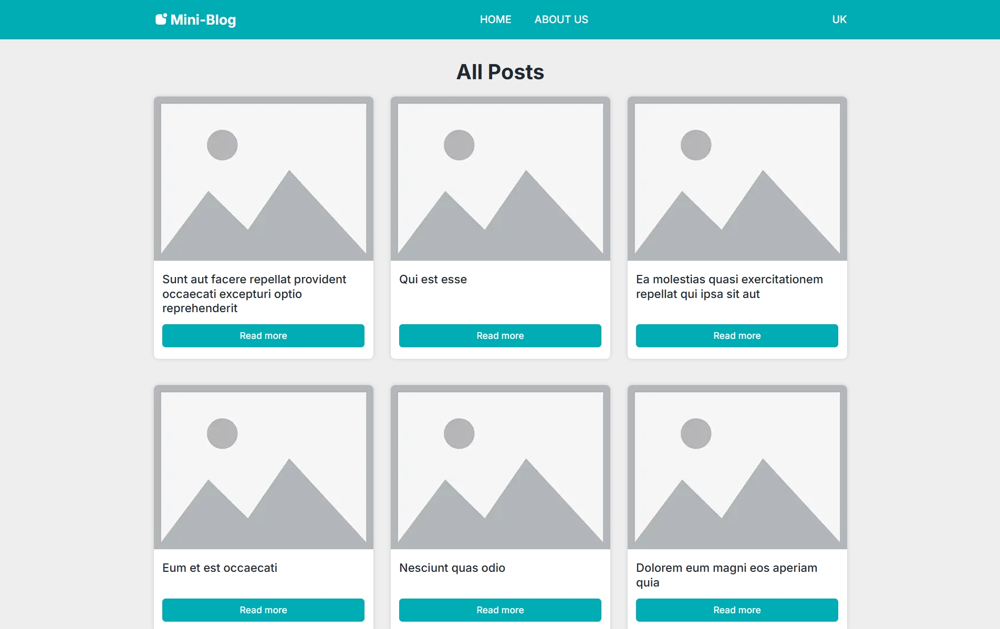

# 🌐 Multilang Mini-Blog

A minimalist multilingual blog built with **Next.js App Router**, **TypeScript**, and **SCSS**. Designed with a clean, responsive UI and intuitive page transitions.



## ✨ Features

- Multilanguage support (e.g., `/en`, `/uk`)
- Static generation with `generateStaticParams` and `generateMetadata`
- SEO metadata per locale
- Dynamic content loading per post
- Clean UI/UX with animated route transitions
- Responsive layout with mobile support
- Modular scalable structure

## 🛠 Tech Stack

- Next.js 15 (App Router)
- React 19
- TypeScript
- SCSS Modules
- clsx
- ldrs (spinner library)
- JSONPlaceholder (mock API)

## 📁 Project Structure

```
src/
└─ app/
   ├─ layout.tsx
   ├─ global-error.tsx
   ├─ not-found.tsx
   └─ [lang]/
      ├─ layout.tsx
      ├─ loading.tsx
      ├─ page.tsx
      ├─ [...missing]/
      │  └─ page.tsx
      ├─ about/
      │  └─ page.tsx
      └─ posts/
         └─ [id]/
            ├─ page.tsx
            └─ error.tsx
├─ components/
├─ constants/
├─ hooks/
├─ lib/
├─ locales/
├─ styles/
├─ types/
├─ middleware.ts
public/
├─ images/
├─ favicon.ico
├─ favicon.svg
└─ svgSprite.svg
```

## 📌 Live Demo

🔗 [https://mini-blog-bay-beta.vercel.app/en](https://mini-blog-bay-beta.vercel.app/en)

## 👨‍💻 Author

Created by [Valentyn Mostovyi](https://github.com/Valentyn-M)

---
